# Intervuex

Intervuex is a full stack interview scheduling application for hiring teams. Company admins create workspaces and manage HR users. HR staff schedule interviews, track candidates in a pipeline, and view analytics.

Sign in is for **Admin** and **HR** only. Candidates and interviewers are email addresses on each interview; they do not log in to the app.

---

## Live application

These URLs are public. Anyone can open them in a browser.

### Production (full app)

**https://intervuex-nine.vercel.app**

The main live deployment: React on Vercel, API on Railway, data in MongoDB Atlas.

Open this link to see the landing page and login screen. After sign in, Admin and HR users can manage workspaces, schedule interviews, and use the pipeline. New HR users can register with a workspace Space code from their company admin.

### UI demo (preview)

**https://intervuex-demo.vercel.app**

A read-only style preview with sample data. No database required.

1. Open the link  
2. On login, click **Admin** or **HR**  
3. Explore the interface  

Demo login (shown on the site): `admin@intervuex.com` / `12345678`

### API health

**https://intervuex-production-5e78.up.railway.app/api/health**

Returns JSON, not a normal web page. If you see `"status":"ok"` and `"database":"connected"`, the production API and database are running.

---

## Features

**Workspaces**  
Admins create company workspaces with an 8 character Space code. HR joins via code or is added from Team.

**Interview scheduling**  
Four step wizard: details, date and time, meeting link, review. Panel interviewers supported. The system checks MongoDB for overlapping interviews before saving.

**Meeting links**  
In the live app, HR selects **Meeting link** and pastes a URL from Zoom, Google Meet, Microsoft Teams, or any provider. The link is stored on the interview and shown in the pipeline and emails.

The codebase also includes **Google Meet auto generation**: the backend can create a Meet link through the Google Calendar API (`conferenceData` on a calendar event) when Google Calendar is connected and that flow is enabled. See `backend/src/services/meetingGenerationService.js`. The current schedule wizard uses manual links for simplicity on production.

**Pipeline and analytics**  
Kanban board by status. Dashboards and charts for hiring activity.

**Admin**  
Team, audit log, settings, light/dark theme.

**Email and sign in (optional)**  
SMTP for invitations and reminders. Google account sign in when OAuth variables are set (`backend/.env.example`).

---

## Tech stack

React, Vite, Tailwind CSS, Node.js, Express, MongoDB, JWT, Vercel, Railway

---

## Screenshots

### Public and auth

Landing page

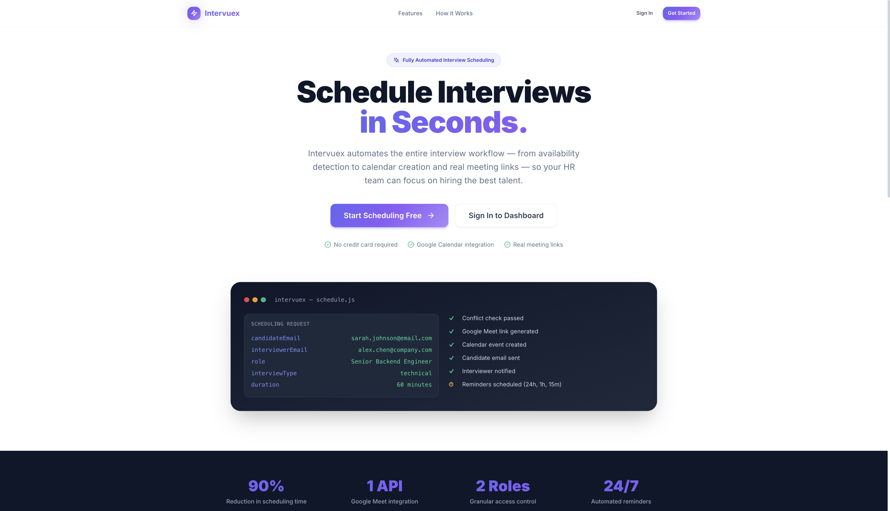

Login

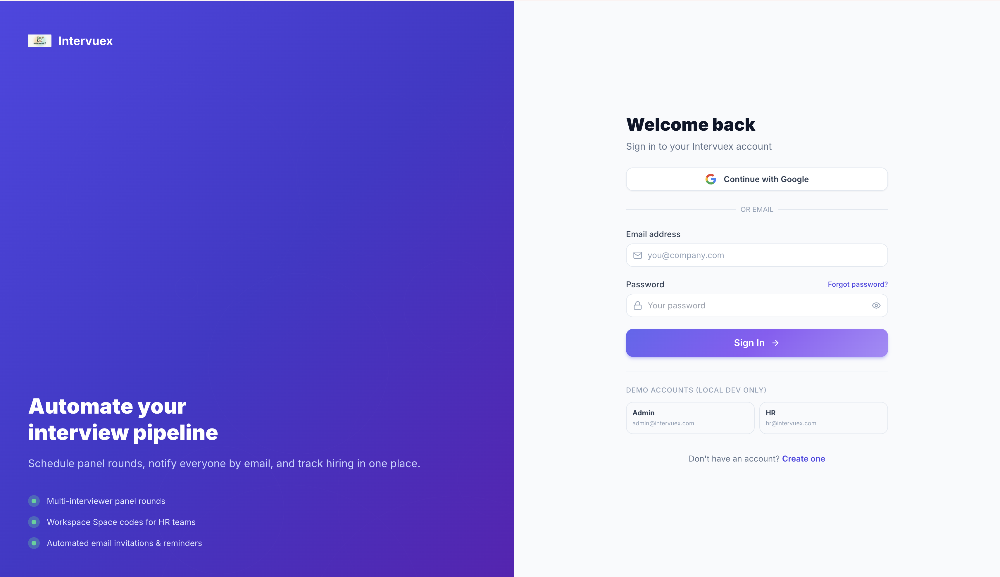

Register

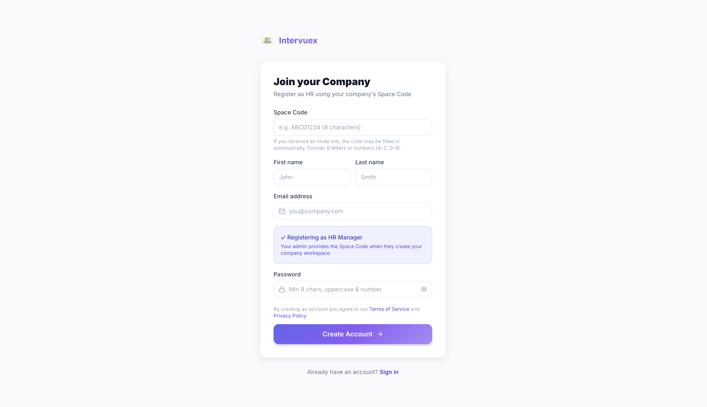

### Admin

Dashboard

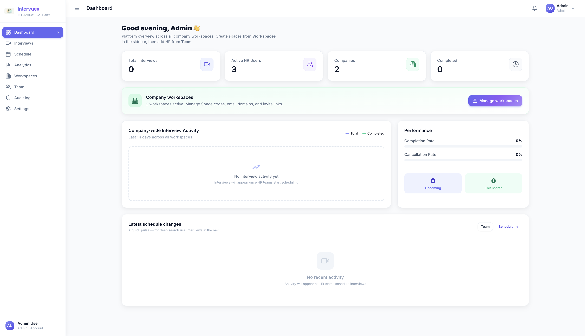

Workspaces

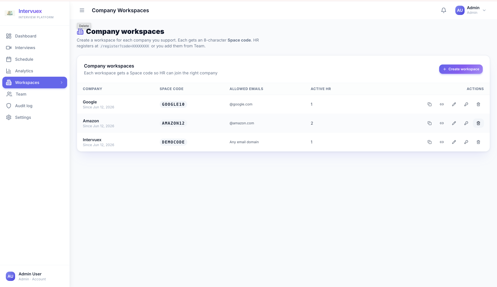

Team

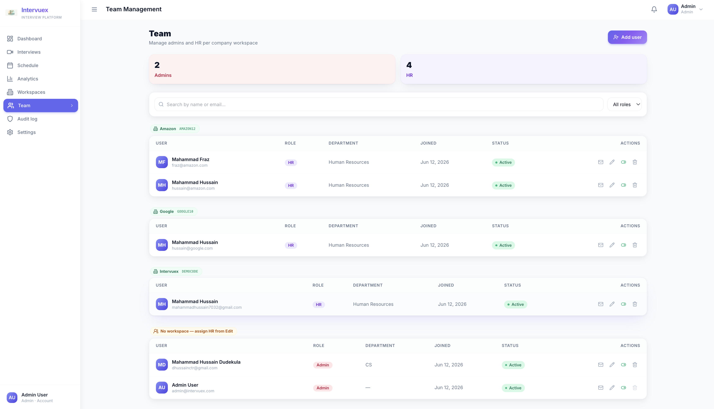

Schedule (panel)

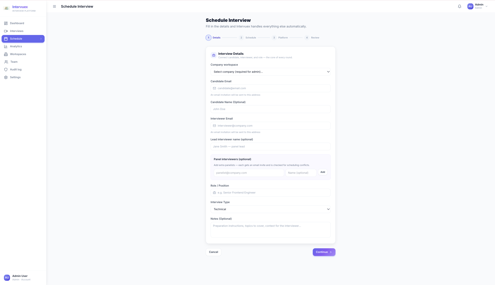

Schedule review

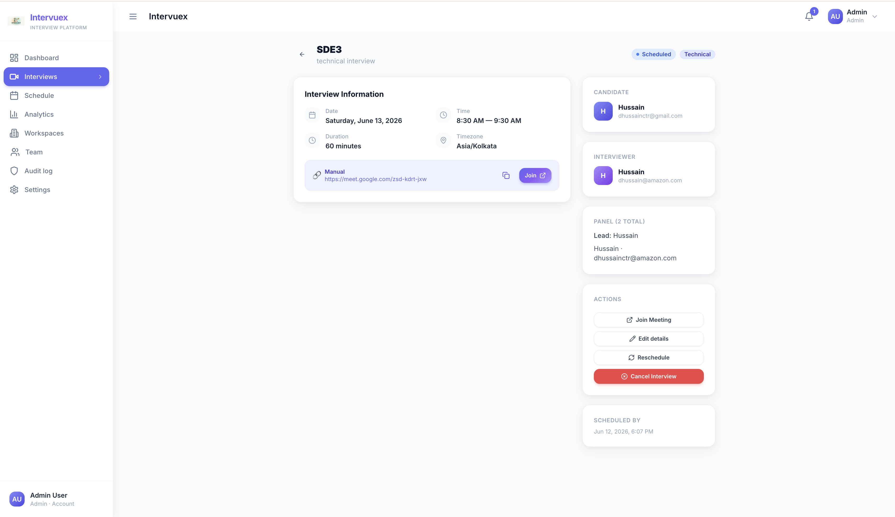

Analytics

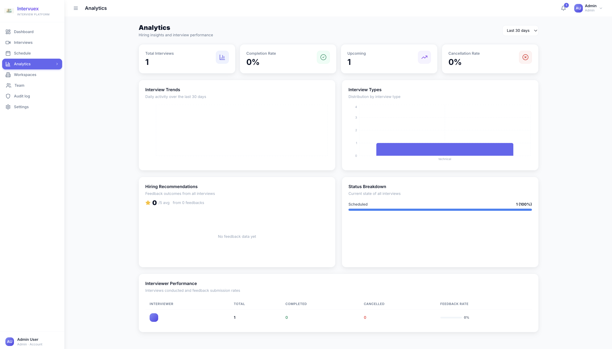

Audit log

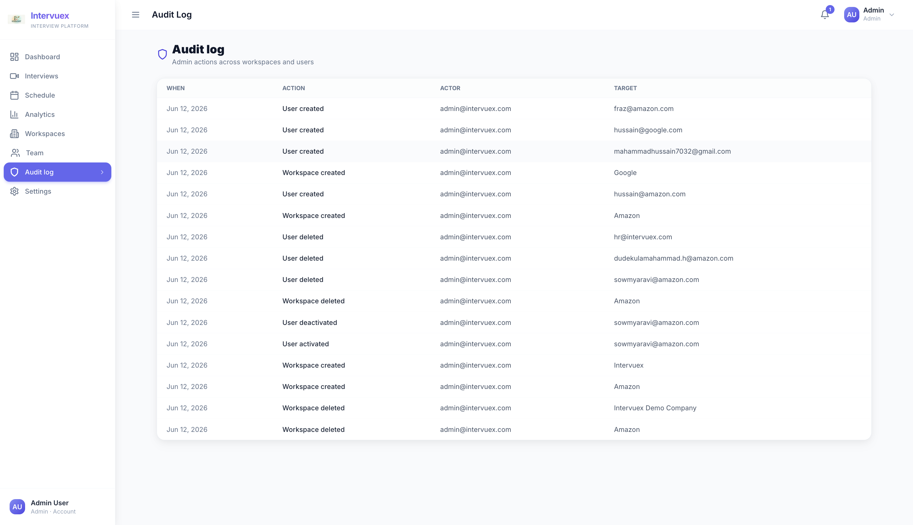

Settings

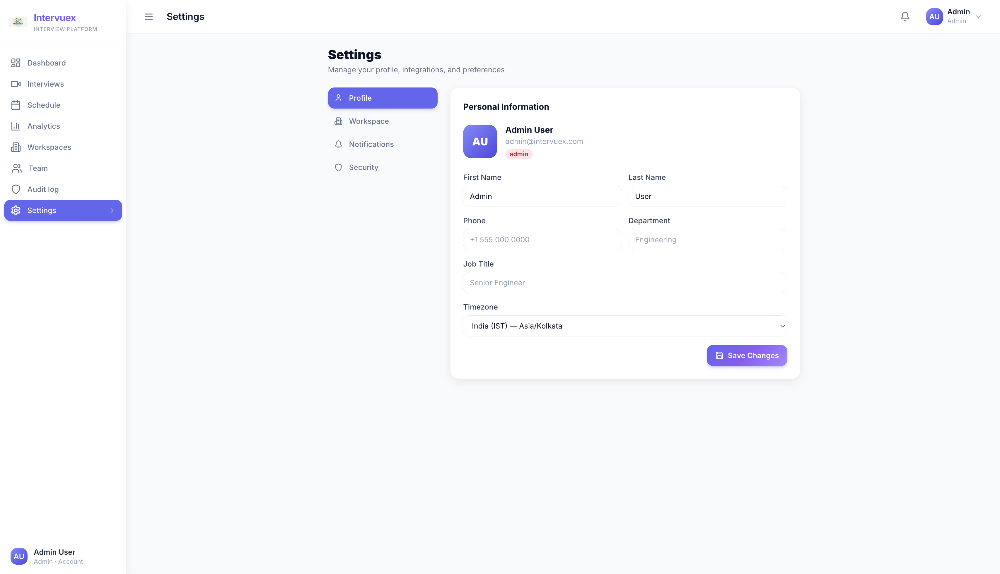

### HR

Dashboard

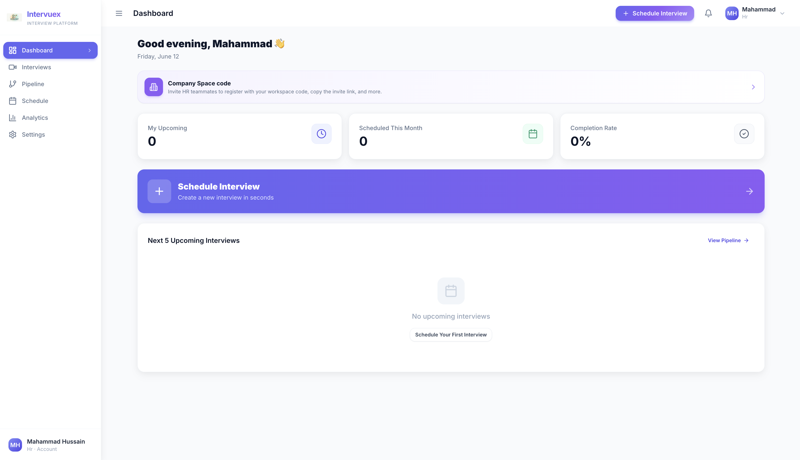

Interviews

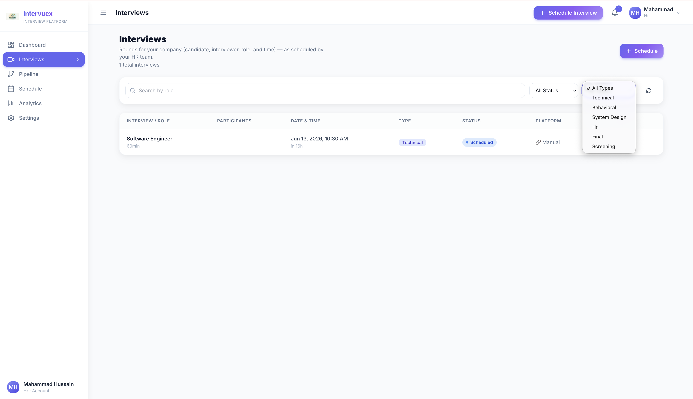

Pipeline

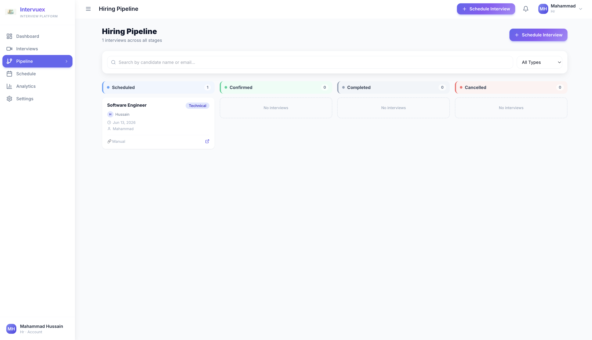

Schedule

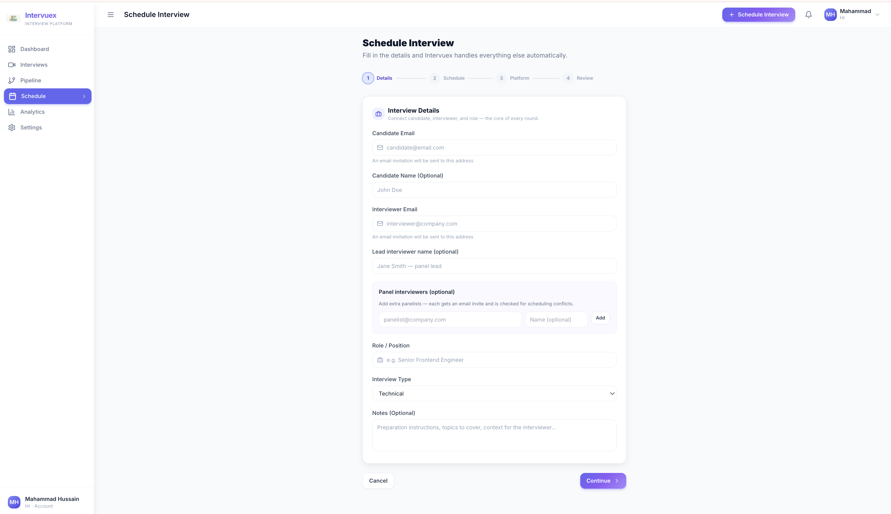

Analytics

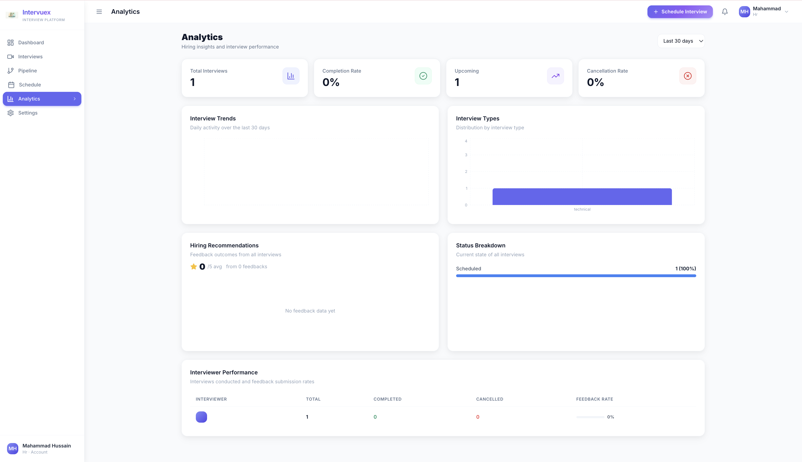

Settings

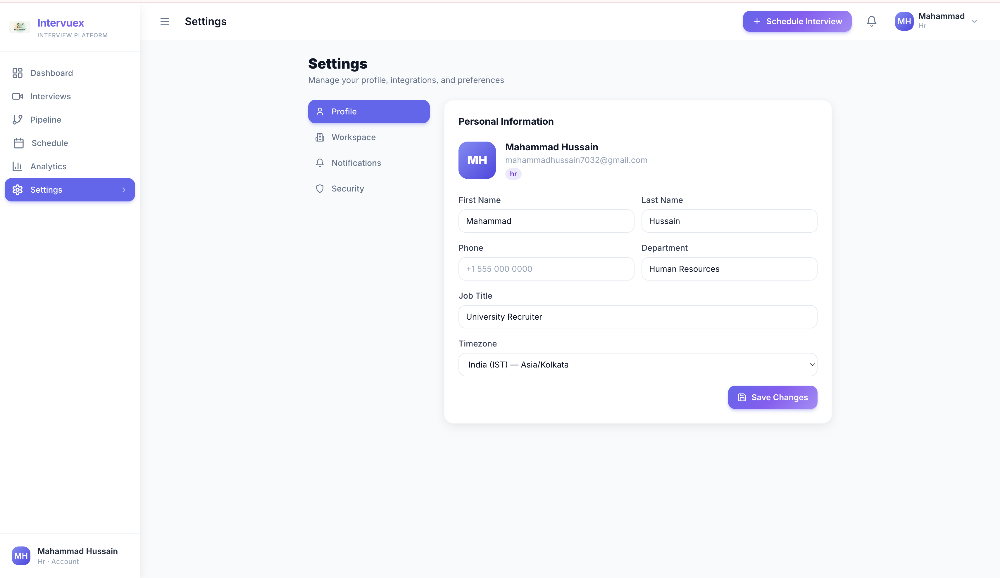

---

## Run locally

Requires Node.js 18+ and MongoDB (local or Atlas).

```bash
git clone https://github.com/Mahammad1500/Intervuex.git
cd Intervuex
npm run install:all
npm run setup:env
```

Edit `backend/.env` and `frontend/.env` using the `.env.example` files in each folder.

```bash
npm run dev
```

App: http://localhost:3000  
Health: http://localhost:5000/api/health  

Optional: `curl -X POST http://localhost:5000/api/seed` (local dev only) · `npm test`

---

## License

Copyright (c) 2026 Mahammad1500

Released under the [MIT License](./LICENSE).
